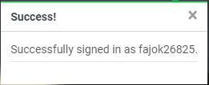

# KeyCraft

 

Developer: [Logan Carlow](https://github.com/TerraBite147)  
[Live webpage](https://keycraft-51244bb1d3f4.herokuapp.com/) 
[Project Repository](https://github.com/TerraBite147/KeyCraft) 

## Table of Contents

- [KeyCraft](#keycraft)
  - [Table of Contents](#table-of-contents)
  - [Overview](#overview)
  - [User Experience](#user-experience)
    - [Agile Methodology](#agile-methodology)
    - [User Epics](#user-epics)
  - [Design](#design)
    - [Database Schema](#database-schema)
    - [Wireframes](#wireframes)
    - [Typography](#typography)
    - [Colours](#colours)
    - [Color Palette](#color-palette)
    - [Icons](#icons)
  - [Features](#features)
    - [Nav Bar](#nav-bar)
    - [Landing Page](#landing-page)
    - [Product List Page](#product-list-page)
    - [Product Detail View](#product-detail-view)
    - [Search, Order \& Filter](#search-order--filter)
    - [Bag](#bag)
    - [Order From](#order-from)
    - [Checkout Confirmation Page](#checkout-confirmation-page)
    - [Profile Page](#profile-page)
    - [Register, Log In \& Log Out](#register-log-in--log-out)
    - [Footer](#footer)
    - [Product Create](#product-create)
    - [Product Edit](#product-edit)
    - [Contact Page](#contact-page)
    - [FAQ](#faq)
    - [Error Pages](#error-pages)
    - [Messages](#messages)
  - [Features Left to Implement](#features-left-to-implement)
- [Testing](#testing)
  - [SEO Testing](#seo-testing)
  - [Code Validation](#code-validation)
  - [Manual Testing](#manual-testing)
  - [Known Bugs](#known-bugs)
  - [Technologies Used](#technologies-used)
    - [Languages Used](#languages-used)
    - [Libraries \& Frameworks](#libraries--frameworks)
  - [Web Marketing](#web-marketing)
    - [Key Advantages for KeyCraft:](#key-advantages-for-keycraft)
    - [Target Audience:](#target-audience)
    - [Marketing and Customer Engagement Strategies:](#marketing-and-customer-engagement-strategies)
    - [Site Features and User Experience:](#site-features-and-user-experience)
  - [Search Engine Optimization](#search-engine-optimization)
    - [sitemap.xml](#sitemapxml)
    - [robots.txt](#robotstxt)
  - [Deployment](#deployment)
    - [Heroku Deployment](#heroku-deployment)
    - [Tools](#tools)
    - [Content](#content)
    - [Information Resources](#information-resources)

## Overview
KeyCraft is an e-commerce platform for enthusiasts to buy and customize keyboards, switches, and keycaps. The platform offers a seamless shopping experience with user-friendly navigation, detailed product information, and secure checkout. KeyCraft is built with Django, a high-level Python web framework, and uses ElephantSQL for the database. The platform is hosted on Heroku and uses Cloudinary and Whitenoise for static and media files storage.

## User Experience
### Agile Methodology
KeyCraft was developed using the Agile methodology, which emphasizes iterative development, collaboration, and flexibility. The project was divided into sprints, with each sprint focusing on specific features and user stories. The Agile methodology allowed for continuous feedback and improvements, ensuring that the final product meets user requirements and expectations.

### User Epics
KeyCraft is designed to meet the following user epics:

1. [User Registration and Authentication](https://github.com/TerraBite147/KeyCraft/milestone/1?closed=1)
2. [Product Browsing and Search](https://github.com/TerraBite147/KeyCraft/milestone/2?closed=1)
3. [Product Reviews](https://github.com/TerraBite147/KeyCraft/milestone/3)
4. [Shopping Cart and Checkout](https://github.com/TerraBite147/KeyCraft/milestone/4?closed=1)
5. [Order Management](https://github.com/TerraBite147/KeyCraft/milestone/5?closed=1)
6. [Admin Management](https://github.com/TerraBite147/KeyCraft/milestone/6)
7. [Customer Support](https://github.com/TerraBite147/KeyCraft/milestone/7?closed=1)
8. [Marketing and Promotions](https://github.com/TerraBite147/KeyCraft/milestone/8)

Each Epic handles key requirements broken down into various user stroies.

[User Stroies](https://github.com/TerraBite147/KeyCraft/issues?q=is%3Aissue+is%3Aclosed)

## Design

### Database Schema
- The database schema was created using dbdiagram.io. The schema was created to show the relationships between the different models in the database.
  

### Wireframes

Wireframes were created using Balsamiq. The wireframes were created for desktop with the goal being to create a responsive design. The wireframes were created for the following pages:

Wireframes

- Product List Page
  - 

- Product Detail Page
  - 

- Bag Page
  - 

- Checkout Page
  - 

- Profile Page
  - 

### Typography

- Roboto

  - The decision to use Lato for KeyCraft stems from its versatility and readability. Roboto offers a balance between serious and friendly tones, making it suitable for a wide range of applications. Its well-structured characters enhance readability, which is crucial for an e-commerce platform where clear communication is key.

### Colours

### Color Palette

| Swatch | Name | Hex | RGB | Description |
|--------|------|-----|-----|-------------|
|  | **Papaya whip** | `#feeed4` | `rgb(254, 238, 212)` | Used as the background color for the main content area. |
|  | **Emerald** | `#34d399` | `rgb(52, 211, 153)` | Used for the logo, accent text, and the 'Find the perfect Keyboard' button. |
|  | **White** | `#ffffff` | `rgb(255, 255, 255)` | Used for the text in the navigation bar and other text elements. |
|  | **Onyx** | `#343a40` | `rgb(52, 58, 64)` | Used for the header and footer background. |
|  | **Eerie black** | `#181817` | `rgb(24, 24, 23)` | Used as the background for certain sections and buttons. |

### Icons

- [Font Awesome](https://fontawesome.com/) - Used for all icons on the site.

## Features

### Nav Bar

- The navigation bar is fixed to the top of the page and is visible on all pages. Its optimised for mobile and desktop view. The navigation bar contains links to all the pages on the site as well as a search bar and a link to the user's shopping bag. There is also a link to the user's profile if they are logged in. If the user is an admin user they will also see a link to the product management page. When opened on mobile the navigation bar collapses into a hamburger menu.
- Desktop
  

- Mobile
  

### Landing Page

- The landing page is the first page the user sees when they visit the site. It contains a hero image and a call to action button to view all products.

- The Landing page is used as an about page as well, further down will discribe the site and what you can find.

### Product List Page

- The product list page displays all the products available on the site. The user can filter the products by category and sort the products by price, name and rating. Users can also search for a product by name using the search bar. The avergae rating of the product is also displayed on the product card.

### Product Detail View

- The product detail view displays all the details of a product. The user can select the quantity they want of the product to add to their shopping bag from this page.

### Search, Order & Filter

- The user can search for a product by name using the search bar. The user can also filter the products by category and sort the products by price, name and rating.
 
  

  

### Bag

- The bag page displays all the products the user has added to their shopping bag. It shows the product name, price,, quantity and subtotal. The user can update the quantity of a product using the input field. The user can also remove a product from their shopping bag. The user can also see the total cost of all the products in their shopping bag. The user can also see the delivery cost and the grand total of their order. They will also see a message notifing them of the free delivery threshold. The options to continue shopping or proceed to checkout are also available.

### Order From

- The order form page allows the user to enter their delivery details and payment information. The user can also save their delivery details to their profile. On the right side of the page, the user can see the order summary. It lists all the products in the user's shopping bag, the delivery cost, the grand total.

### Checkout Confirmation Page

- The order confirmation page displays the user's order details and order number. The user will also receive an email confirmation of their order when the order is placed. There is also a link to go back to the user's profile page.

### Profile Page

- The profile page displays the user's delivery details and order history. The user can also update their delivery details on this page.

### Register, Log In & Log Out

- The user can register for an account, log in and log out of their account.

 

### Footer

- The footer is visible on all pages and contains links to the site's social media pages and contact form as well as quick links to other pages.

### Product Create

- Admin users can create new products on the site.

### Product Edit

- Admin users can edit existing products details on the site.

### Contact Page

- The contact page contains a contact form that allows the user to send a message to the site admin.

### FAQ

- The FAQ page contains a list of FAQ's and a link to the contact form to ask more questions.
- 

- The admin will have options to add edit and delete FAQs

### Error Pages

- The site contains custom error page for 404 errors.

### Messages

- The site displays toast messages to the user to inform them of the status of their actions.

- Login Success
  - 
- Logout Success
  - 
- Item add
  - 
- Bag Update
  - 
- Bag item remove
  - 
- Checkout Success
  - 
- Profile Update
  - 
- Confirm Email
  - 
  

## Features Left to Implement

- Stock management system to track stock levels and allow admin to add stock. The sale of an item would also update the stock level automatically.
- A blog section to keep users up to date with the latest news and promotions.
- Star rating picker for product reviews.
- A Newsletter feature.

# Testing

## SEO Testing

- The site was tested using the Lighthouse tool in Chrome DevTools. With an average score of 90 for all pages.
- The main issue was with cloudinary images not being served over https. This is a known issue and will be resolved in future updates.

## Code Validation
- Html was validated using the W3C validator. minor issues were found and will be resolved in future updates.

- CSS was validated using the W3C CSS validator. No issues were found.

- Python was validated using the Code Institute Python Linter. minor issues with length of lines were found and will be resolved in future updates.

- JSHint was used to validate the JavaScript. No issues were found.

## Manual Testing

| Test | Description | method | Expected Result | Actual Result | Pass/Fail |
|------|-------------|--------|-----------------|---------------|-----------|
| 1 | User can register for an account | Click on the register link in the navigation bar and fill in the registration form | User receives a verification email and is redirected to the login page | User receives a verification email and is redirected to the login page | Pass
| 2 | User can log in to their account | Click on the login link in the navigation bar and fill in the login form | User is logged in and redirected to the home page | User is logged in and redirected to the home page | Pass |
| 3 | User can log out of their account | Click on the logout link in the navigation bar | User is logged out and redirected to the home page | User is logged out and redirected to the home page | Pass |
| 4 | User can view all products | Click on the view all products button on the home page | User is redirected to the product list page and can see all the products | User is redirected to the product list page and can see all the products | Pass |
| 5 | User can view product details | Click on a product card on the product list page | User is redirected to the product detail page and can see all the details of the product | User is redirected to the product detail page and can see all the details of the product | Pass |
| 6 | User can add a product to their shopping bag | Click on the add to bag button on the product detail page | The product is added to the user's shopping bag and a message is displayed to the user | The product is added to the user's shopping bag and a message is displayed to the user | Pass |
| 7 | User can view their shopping bag | Click on the shopping bag link in the navigation bar | User is redirected to the shopping bag page and can see all the products in their shopping bag | User is redirected to the shopping bag page and can see all the products in their shopping bag | Pass |
| 8 | User can update the quantity of a product in their shopping bag | Change the quantity of a product in the shopping bag and click the update button | The quantity of the product is updated and the total cost is updated | The quantity of the product is updated and the total cost is updated | Pass |
| 9 | User can remove a product from their shopping bag | Click on the remove button next to a product in the shopping bag | The product is removed from the shopping bag and the total cost is updated | The product is removed from the shopping bag and the total cost is updated | Pass |
| 10 | User can proceed to checkout | Click on the proceed to checkout button on the shopping bag page | User is redirected to the order form page | User is redirected to the order form page | Pass |
| 11 | User can place an order | Fill in the order form and click the place order button | User receives an order confirmation email and is redirected to the order confirmation page | User receives an order confirmation email and is redirected to the order confirmation page | Pass |
| 12 | User can view their order history | Click on the profile link in the navigation bar | User is redirected to the profile page and can see their order history | User is redirected to the profile page and can see their order history | Pass |
| 13 | User can update their delivery details | Click on the update delivery details button on the profile page | User can update their delivery details and save the changes | User can update their delivery details and save the changes | Pass |
| 14 | User can search for a product | Enter a search term in the search bar and click the search button | User is redirected to the product list page and can see the search results | User is redirected to the product list page and can see the search results | Pass |
| 15 | User can filter products by category | Select a category from the category dropdown and click the filter button | User is redirected to the product list page and can see the filtered products | User is redirected to the product list page and can see the filtered products | Pass |
| 16 | User can sort products by price | Select a sort option from the sort dropdown and click the sort button | User is redirected to the product list page and can see the sorted products | User is redirected to the product list page and can see the sorted products | Pass |
| 17 | User can sort products by name | Select a sort option from the sort dropdown and click the sort button | User is redirected to the product list page and can see the sorted products | User is redirected to the product list page and can see the sorted products | Pass |
| 18 | User can sort products by rating | Select a sort option from the sort dropdown and click the sort button | User is redirected to the product list page and can see the sorted products | User is redirected to the product list page and can see the sorted products | Pass |
| 19 | Admin user can add a product | Click on the add product link in the navigation bar and fill in the product form | Product is added to the site and is visible on the product list page | Product is added to the site and is visible on the product list page | Pass |
| 20 | Admin user can edit a product | Click on the edit button next to a product on the product list page and fill in the product form | Product details are updated and are visible on the product list page | Product details are updated and are visible on the product list page | Pass |
| 21 | Admin user can delete a product | Click on the delete button next to a product on the product list page | Product is deleted from the site and is no longer visible on the product list page | Product is deleted from the site and is no longer visible on the product list page | Pass |
| 22 | User can send a message to the site admin | Click on the contact link in the footer and fill in the contact form | Site admin can see the message in the admin panel | Site admin can see the message in the admin panel | Pass |
| 23 | User can view the FAQ page | Click on the FAQ link in the footer | User is redirected to the FAQ page and can see the FAQ's | User is redirected to the FAQ page and can see the FAQ's | Pass |
| 24 | Admin user can add a FAQ | Click on the add FAQ link in the navigation bar and fill in the FAQ form | FAQ is added to the site and is visible on the FAQ page | FAQ is added to the site and is visible on the FAQ page | Pass |
| 25 | Admin user can edit a FAQ | Click on the edit button next to a FAQ on the FAQ page and fill in the FAQ form | FAQ details are updated and are visible on the FAQ page | FAQ details are updated and are visible on the FAQ page | Pass |
| 26 | Admin user can delete a FAQ | Click on the delete button next to a FAQ on the FAQ page | FAQ is deleted from the site and is no longer visible on the FAQ page | FAQ is deleted from the site and is no longer visible on the FAQ page | Pass |
| 27 | User can view the 404 error page | Enter an invalid URL in the browser | User is redirected to the 404 error page | User is redirected to the 404 error page | Pass |
| 29 | Mobile Responsiveness home page | Open the site on a mobile device | The site is responsive and the content is displayed correctly | The site is responsive and the content is displayed correctly | Pass |
| 30 | Mobile Responsiveness product list page | Open the site on a mobile device | The site is responsive and the content is displayed correctly | The site is responsive and the content is displayed correctly | Pass |
| 31 | Mobile Responsiveness product detail page | Open the site on a mobile device | The site is responsive and the content is displayed correctly | The site is responsive and the content is displayed correctly | Pass |
| 32 | Mobile Responsiveness shopping bag page | Open the site on a mobile device | The site is responsive and the content is displayed correctly | The site is responsive and the content is displayed correctly | Pass |
| 33 | Mobile Responsiveness order form page | Open the site on a mobile device | The site is responsive and the content is displayed correctly | The site is responsive and the content is displayed correctly | Pass |
| 34 | Mobile Responsiveness order confirmation page | Open the site on a mobile device | The site is responsive and the content is displayed correctly | The site is responsive and the content is displayed correctly | Pass |
| 35 | Mobile Responsiveness profile page | Open the site on a mobile device | The site is responsive and the content is displayed correctly | The site is responsive and the content is displayed correctly | Pass |
| 36 | Mobile Responsiveness contact page | Open the site on a mobile device | The site is responsive and the content is displayed correctly | The site is responsive and the content is displayed correctly | Pass |
| 37 | Mobile Responsiveness FAQ page | Open the site on a mobile device | The site is responsive and the content is displayed correctly | The site is responsive and the content is displayed correctly | Pass |
| 38 | Mobile Responsiveness 404 error page | Open the site on a mobile device | The site is responsive and the content is displayed correctly | The site is responsive and the content is displayed correctly | Pass |

## Known Bugs

- Images hosted on Cloudinary are using http instead of https, this is causing a mixed content error in the console. This is a known issue with Cloudinary and is being worked on by the Cloudinary team. The images are still being displayed correctly on the site.

Browse to the [TESTING.md](TESTING.md) file for the full testing documentation.

## Technologies Used

### Languages Used

- HTML5

- CSS3

- JavaScript

- Python

### Libraries & Frameworks

- Django:
  - The Django web framework was used to create the full-stack web application.

- Django Crispy Forms:
  - A Django app that provides a way to control the rendering behavior of Django forms in a DRY manner. It is used to create elegant, div-based forms.

- Django Allauth:
  - Provides authentication, registration, and account management. It supports multiple authentication sources like social media platforms.

- Django Storages:
  - A collection of custom storage backends for Django. It allows Django projects to store files in locations other than the local filesystem, such as cloud storage services.

- Stripe Library:
  - This library is used to integrate payment services provided by Stripe into web applications, allowing for the processing of payments.

- Django Countries:
  - A Django app that provides country objects and a country field for models, enabling easy handling of country selection in forms.

- Psycopg2-Binary:
  - A PostgreSQL database adapter for Python, providing efficient and secure database connections.

- PostgreSQL:
  - PostgreSQL was used as the object-relational database system.

- ElephantSQL:
  - ElephantSQL offers PostgreSQL as a service, which can be used to host and manage the database in the cloud.

- Git:
  - Git was used for version control by utilizing the Gitpod terminal to commit to Git and Push to GitHub.

- GitHub:
  - GitHub is used to store the projects code after being pushed from Git.

- Heroku:
  - Heroku was used to deploy the application, providing a platform as a service (PaaS) that enables developers to build, run, and operate applications entirely in the cloud.

- Gunicorn:
  - A Python WSGI HTTP server for UNIX, used to run Python web applications.
  
- Cloudinary:
  - Used to host images uploaded by the site owner.

- Whitenoise: 
    - Used to host static files.

- dj-database-url:
  - A Django utility that allows you to utilize the 12factor inspired DATABASE_URL environment variable to configure your Django application.
 

## Web Marketing

KeyCraft stands as a premier B2C e-commerce platform, dedicated to providing high-quality mechanical keyboards and accessories for gamers, programmers, and typing enthusiasts. Our extensive product range includes customizable keyboards, keycaps, switches, and other peripherals, ensuring we cater to all keyboard enthusiasts.

### Key Advantages for KeyCraft:
- **High-Quality Products**: We source and offer the best mechanical keyboards and accessories to meet the needs of our diverse customer base.
- **Competitive Pricing**: By maintaining competitive prices, we ensure our customers receive the best value for their purchases.
- **Fast Delivery**: Efficient logistics guarantee quick delivery times, minimizing wait periods and enhancing customer satisfaction.
- **Customer Support**: Our dedicated support team is always available to assist with inquiries, provide product recommendations, and ensure a seamless shopping experience.
- **Wide Product Selection**: From entry-level mechanical keyboards to high-end customizable options, our catalog meets the varied demands of keyboard enthusiasts.

### Target Audience:
KeyCraft primarily serves gamers, programmers, and typing enthusiasts looking for high-quality mechanical keyboards and accessories. We also cater to hobbyists and professionals seeking customizable options for their specific needs.

### Marketing and Customer Engagement Strategies:
- **Newsletter** : Utilizing newsletters as a way of keeping intersted customer informe
- **Social Media and Online Marketing**: Leveraging platforms like Instagram, Facebook, and Twitter, we engage with our audience, showcase new products, and run targeted ad campaigns to boost visibility.
- **Content Marketing**: Through blog posts, tutorials, and product reviews, we provide valuable information and tips, enhancing customer knowledge and engagement.
- **Influencer Collaborations**: Partnering with influencers in the tech and gaming communities to reach a broader audience and build brand trust.

- **Facebook Business Page**: Utilizing Facebook's business tools to create a comprehensive business page, we aim to engage with our audience, share product updates, and offer customer support.
  
  
  

  Link to the Facebook Business Page [Here](https://www.facebook.com/people/KeyCraft/61560939701951/)

### Site Features and User Experience:
KeyCraft is designed with user convenience in mind, featuring intuitive navigation, dedicated customer support, and a streamlined purchase process. Our goal is to ensure every visitor can effortlessly find and acquire the products they need to enhance their typing experience.

## Search Engine Optimization

**SEO and Content Strategy**: Utilizing tools like Google Analytics and Ahrefs, we identify and target key search terms relevant to our product offerings. Our content strategy emphasizes KeyCraft's expertise and commitment to quality, positioning us as leaders in the mechanical keyboard market.

**Short Tail Keywords:**
1. "Mechanical Keyboards"
2. "Gaming Keyboards"
3. "Custom Keycaps"
4. "Keyboard Switches"
5. "Mechanical Switches"
6. "Typing Keyboards"
7. "Keyboard Accessories"
8. "RGB Keyboards"
9. "Keyboard Kits"
10. "Ergonomic Keyboards"

**Long Tail Keywords:**
1. "Best Mechanical Keyboards for Gamers"
2. "Top Custom Keycaps for Mechanical Keyboards"
3. "High-Quality Mechanical Switches for Keyboards"
4. "Ergonomic Keyboards for Typing"
5. "RGB Gaming Keyboards with Customizable Lighting"
6. "Keyboard Kits for Building Custom Keyboards"
7. "Mechanical Keyboards for Programmers"
8. "Affordable Keyboard Accessories Online"
9. "Mechanical Keyboard Reviews and Ratings"
10. "Best Keyboard Switches for Typing and Gaming"

### sitemap.xml

Site map was generated using [XML Sitemaps](https://www.xml-sitemaps.com/) and then uploaded to the root directory of the site.

### robots.txt

The robots.txt file was created and uploaded to the root directory of the site.

## Deployment

### Heroku Deployment
1. Create a Heroku account by going to https://signup.heroku.com/
2. Create a new app by clicking the "New" button in the top right corner and then click "Create new app".
3. Enter a name for the app and select the region closest to you.
4. Click the "Create app" button.
5. Select "settings" from the top menu.
6. Click the "Reveal Config Vars" button.
7. Enter the following environment variables with your values:
  - STRIPE_PUBLIC_KEY
  - STRIPE_SECRET_KEY
  - STRIPE_WH_SECRET
  - SECRET_KEY
  - EMAIL_HOST_PASS
  - EMAIL_HOST_USER
  - CLOUDINARY_URL
  - DATABASE_URL
8. Click buildpacks from the top menu.
9. Add the following buildpacks:
  - heroku/python
10. Click the "Deploy" tab from the top menu.
11. Click the "Connect to GitHub" button.
12. Enter https://github.com/TerraBite147/KeyCraft.git and click the "Connect" button.
13. Click the "Enable Automatic Deploys" button.
14. Click the "Deploy Branch" button.
15. Click the "View" button to launch the app.

### Tools

- [Gitpod](https://www.gitpod.io/) - IDE application used to develop code in.
- [Balsamiq](https://balsamiq.com/wireframes/) - Low Fidelity Wireframes
- [W3C Validator](https://validator.w3.org/) - Validator that checks the markup validity for Web Documents in HTML.
- [W3C CSS Validator](https://jigsaw.w3.org/css-validator/) - Validator that checks CSS validity.
- [Code Institute's Python Linter](https://pep8ci.herokuapp.com/) - Validator that checks syntax and stylistic problems in Python code.
- [Am I responsive](https://ui.dev/amiresponsive) - Generates Responsive images for your website.
- [Chrome DevTools and Lighthouse](https://developer.chrome.com/docs/devtools/) - Web Developer Tools.
- [DB Diagram](https://dbdiagram.io/home) - Database Schema Design Tool.
- [JSHint](https://jshint.com/) - JavaScript Validator.

### Content
- Keyboard , switches and key caps are all taken from the below manufacturers webistes.
  - [Akko](https://en.akkogear.com)
  - [CIDOO](https://www.cidoo.cn)
  - [Cherry](https://www.cherry.de)
  - [Epomaker](https://epomaker.com)
  - [Gateron](https://gateron.com)
  - [KBDFans](https://kbdfans.com)
  - [Keychron](https://www.keychron.com)
  - [KiiBOOM](https://www.kiiBOOM.com)
- The favicon was generated using [ChatGPT](https://chatgpt.com/)
- The Code Institue Boutique Ado walkthrough project was utilized as a frame and guide for the development of this site.

### Information Resources

- [W3Schools - Python](https://www.w3schools.com/python/)
- [Stack Overflow](https://stackoverflow.com/)
- [Youtube](https://youtube.com/)